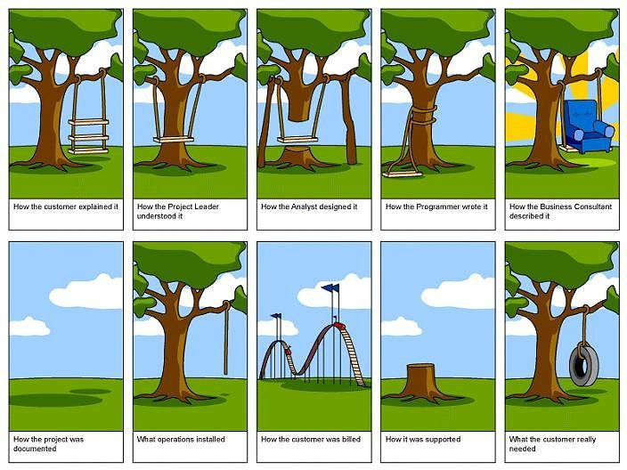

# New Challenge 
Alright, I am preparing for my next job (back in Austria <3), and this position offers generous room for finishing my master's in medical biology, which was about time, I would say.

Also, I am involved in a new project, where I have the chance to dive deeper into database structures and databases in general as well as communicating the thin line between the technical possible of engineering and wizardry of mount mordor.

Having that said, it is a great opportunity to add a skill set to my stack and I will probably also write the backend for this project as well!

Thanks, nerds!
